<div align="center">

# 🩺 OpenHealth

### AI-Powered Multi-Disease Detection & Diagnosis Assistant

An end-to-end healthcare platform that combines deep learning (image-based diagnosis) and machine learning (tabular clinical prediction) with a Gemini-powered medical assistant — all under one Flask application.

[](https://openhealth-4.onrender.com/)
[](https://www.python.org/)
[](https://flask.palletsprojects.com/)
[](https://www.tensorflow.org/)

**🔗 Live Demo:** [https://openhealth-4.onrender.com/](https://openhealth-4.onrender.com/)

</div>

---

## 📖 Overview

**OpenHealth** is a unified disease-detection web application that brings together **9 independent prediction pipelines** — spanning CNN-based medical imaging models and classical ML models on clinical/tabular data — into a single, easy-to-use interface. It also integrates a **Gemini-powered LLM** to generate patient-friendly disease information (symptoms, treatment, and dietary guidance) and includes standalone **chatbot** and **medicine recognition** modules built with Streamlit.

> ⚠️ **Disclaimer:** OpenHealth is an educational/portfolio project. It is **not** a certified medical device and must **not** be used as a substitute for professional medical advice, diagnosis, or treatment.

---

## ✨ Features

### 🖼️ Image-Based Detection (Deep Learning / CNN)

| Module | Classes Detected | Input |
|---|---|---|
| 🫘 **Kidney Disease** | Cyst, Normal, Stone, Tumor | CT Scan |
| 🫁 **Lung Disease** | Bacterial Pneumonia, COVID-19, Normal, Tuberculosis, Viral Pneumonia | Chest X-Ray |
| 🧠 **Brain Tumour** | Glioma, Meningioma, Pituitary, No Tumour | MRI Scan |
| 🦟 **Malaria** | Parasitized, Uninfected | Blood Cell Microscopy Image |

### 📊 Clinical Data Prediction (ML on Tabular Data)

| Module | Prediction |
|---|---|
| 💉 **Diabetes** | Diabetic / Not Diabetic |
| ❤️ **Heart Disease** | Risk Detected / No Risk |
| 🎗️ **Breast Cancer** | Malignant / Benign |
| 🧬 **Parkinson's Disease** | Detected / Not Detected |
| 🫀 **Liver Disease** | Detected / Not Detected (with probability score) |

### 🤖 AI Assistant & Extras

- **Gemini-Powered Insights** — For every detected condition, generates structured information: description, symptoms, treatment, foods to eat, and foods to avoid.
- **GeminiMed Chatbot** — A Streamlit-based conversational medical assistant.
- **Medicine Recognition** — A Streamlit app to identify medicines from images.
- **Confidence Scores** — Every image-based prediction returns class-wise probability breakdowns, not just a single label.

---

## 📸 Screenshots

<div align="center">

### 🏠 Home Page
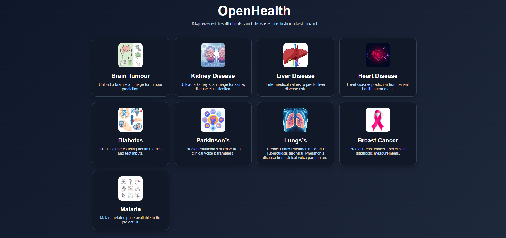

<br>

### 🫘 Kidney Disease Detection

**Upload & Prediction View**
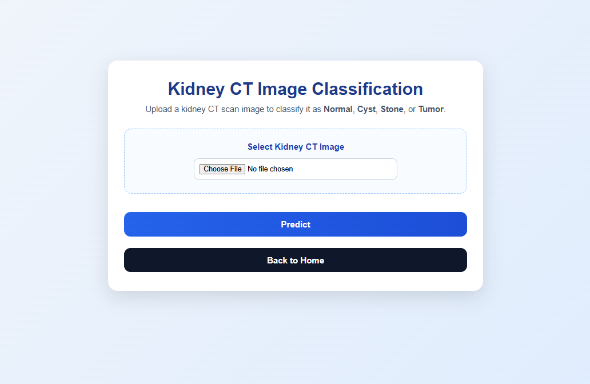

**Result with Confidence Scores**
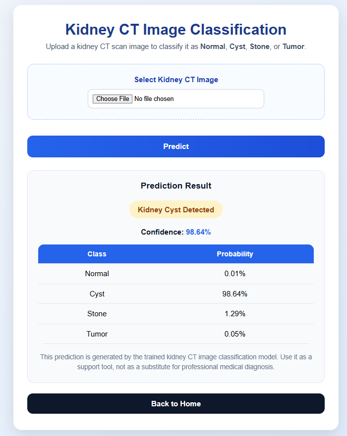

<br>

### 🫁 Lung Disease Detection

**Upload & Prediction View**
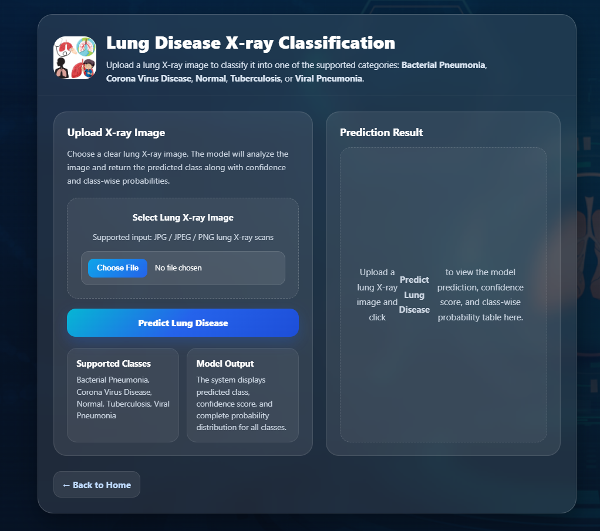

**Result with Confidence Scores**
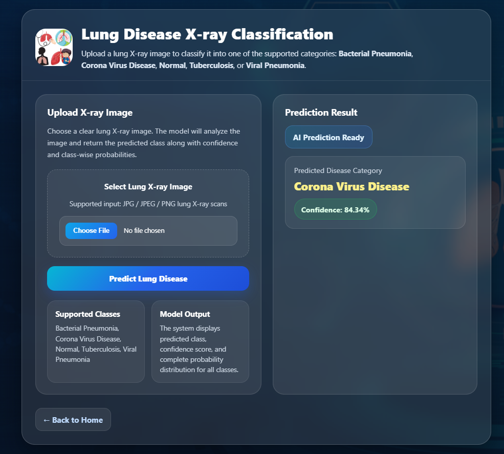

<br>

### 🧠 Brain Tumour Detection

**Upload & Prediction View**
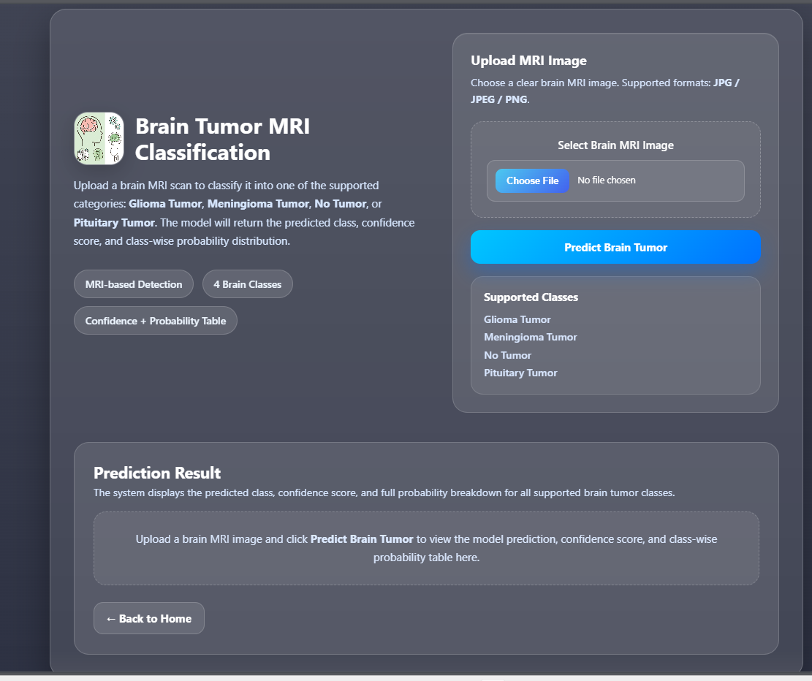

**Result with Confidence Scores**
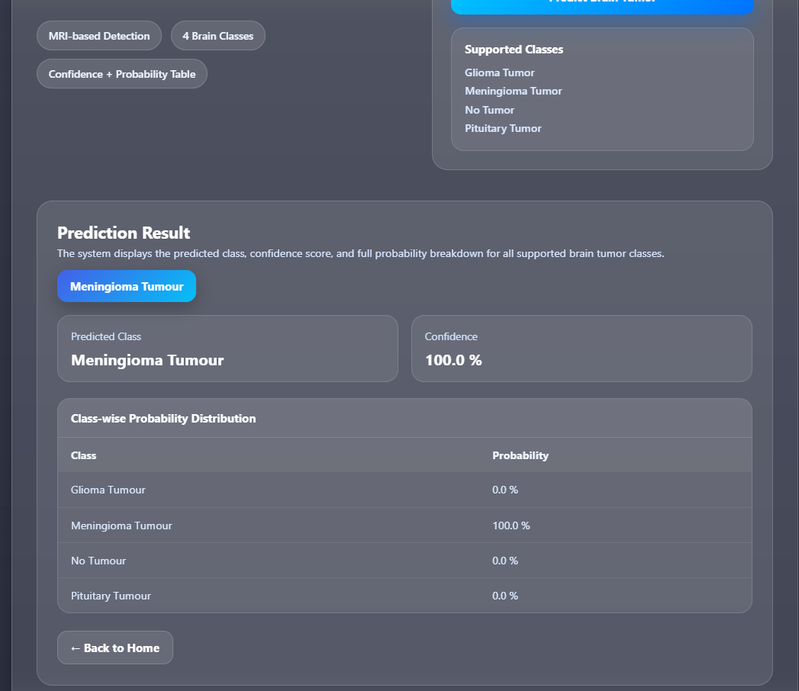

<br>

### 🦟 Malaria Detection

**Upload & Prediction View**
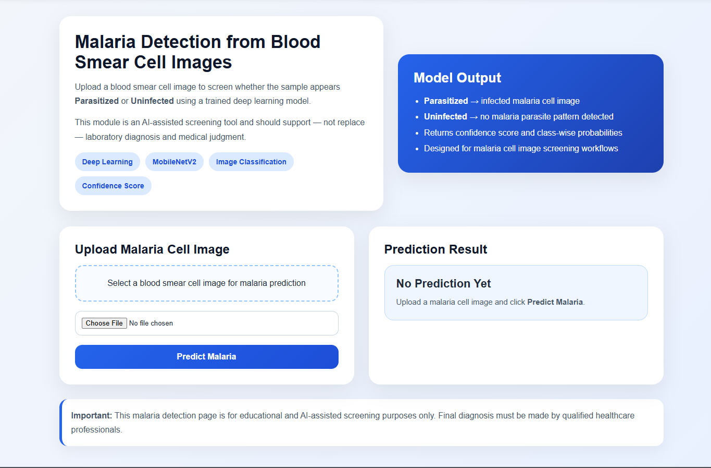

**Result with Confidence Scores**
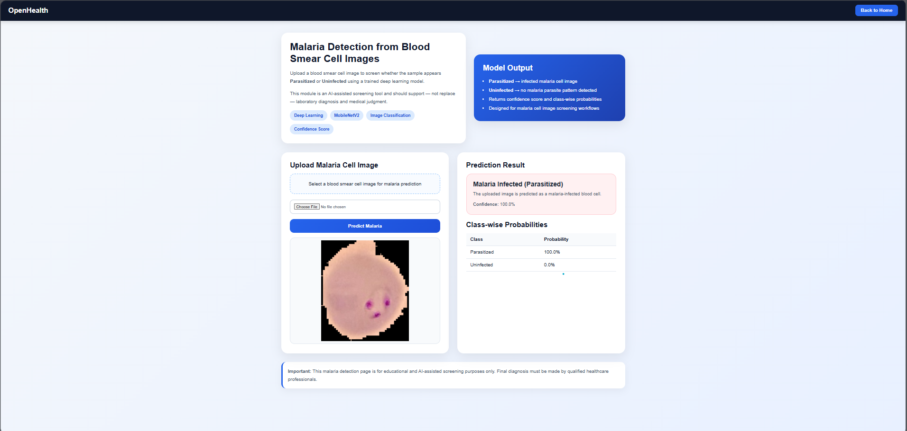

<br>

### ❤️ Heart Disease Prediction
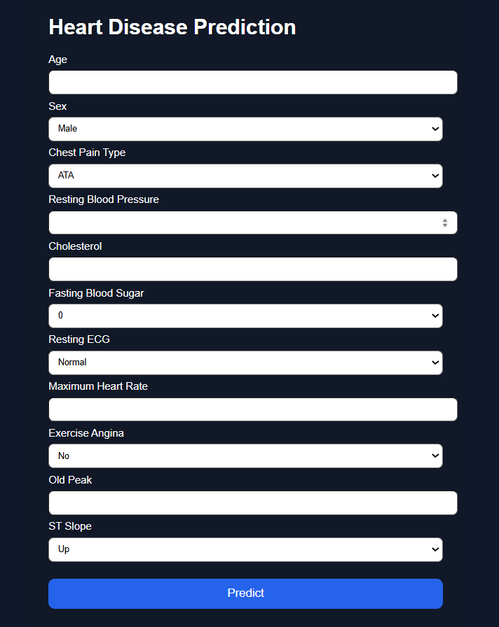

<br>

### 🎗️ Breast Cancer Prediction
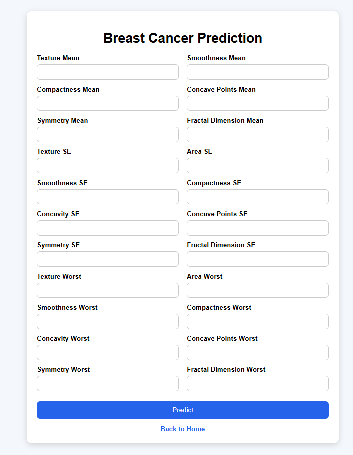

<br>

### 🫀 Liver Disease Prediction
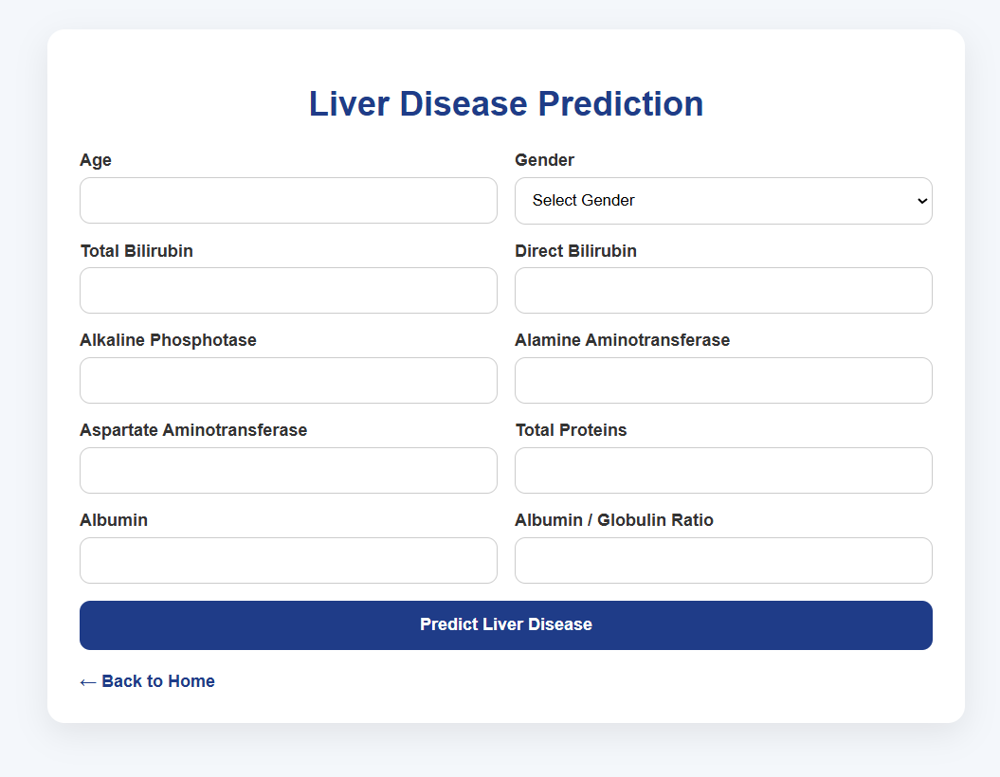

<br>

### 🧬 Parkinson's Disease Prediction
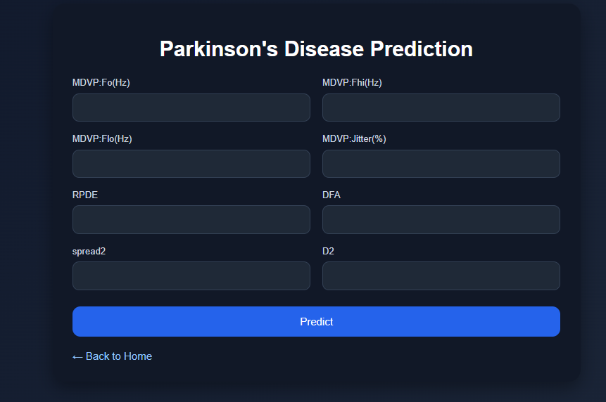

<br>

### 🚀 Render Deployment

**Deployment Dashboard**
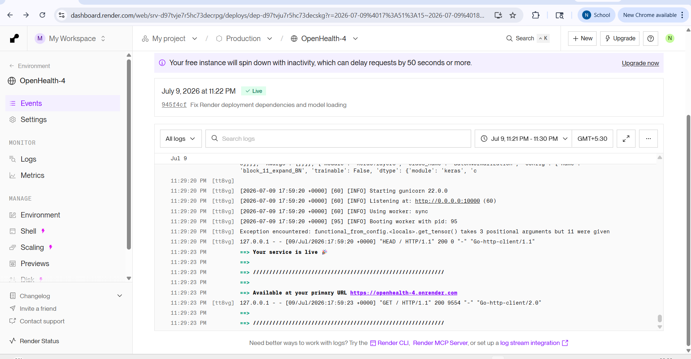

**Live Service Status**
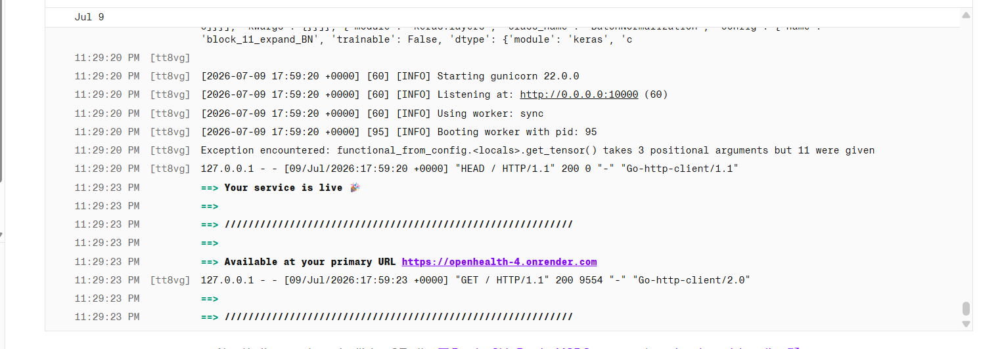

</div>

---

## 🏗️ Tech Stack

| Layer | Technology |
|---|---|
| **Backend** | Flask (Python) |
| **Deep Learning** | TensorFlow / Keras (CNN models: `.h5`) |
| **Machine Learning** | Scikit-learn (pipelines: `.pkl`) |
| **Image Processing** | OpenCV, Pillow (PIL) |
| **Generative AI** | Google Gemini (`google-generativeai`) |
| **Chat / Auxiliary Apps** | Streamlit |
| **Deployment** | Render |
| **Frontend** | HTML, CSS, Jinja2 Templates |

---

## 📁 Project Structure

```
OpenHealth/
├── Artifacts/
│   ├── Kidney_Disease/
│   │   └── Kidney_Model.h5
│   ├── Lung_Disease/
│   │   └── Lung_Model.h5
│   ├── Brain_Tumour/
│   │   └── BrainModel.h5
│   └── Liver_Disease/
│       └── Liver_Model.pkl
├── OpenHealth/
│   └── DiseaseDetection/
│       ├── Malaria_Prediction/
│       ├── Diabetes_Disease_Prediction/
│       ├── Heart_Disease_Prediction/
│       ├── Breast_Cancer_Prediction/
│       ├── Parkinsons_Disease_Prediction/
│       └── Liver_Disease_Prediction/
├── src/
│   ├── GeminiMed/            # Streamlit chatbot
│   └── MedicineRecognition/  # Streamlit medicine recognition app
├── static/
│   ├── css/
│   └── uploads/
├── templates/
│   ├── Main.html
│   ├── kidney.html
│   ├── lung.html
│   ├── brain_tumour.html
│   ├── malaria.html
│   ├── diabetes.html
│   ├── heart.html
│   ├── bcancer.html
│   ├── liver.html
│   ├── parkinsons.html
│   └── llm.html
├── OpenHealthScreenShots/
├── a.py                       # Main Flask application
└── requirements.txt
```

---

## ⚙️ Installation & Setup

### 1. Clone the repository

```bash
git clone https://github.com/<your-username>/OpenHealth.git
cd OpenHealth
```

### 2. Create a virtual environment

```bash
conda create -n OpenHealth python=3.10
conda activate OpenHealth
```

### 3. Install dependencies

```bash
pip install -r requirements.txt
```

### 4. Set environment variables

Create a `.env` file (or set system environment variables):

```
GOOGLE_API_KEY=your_gemini_api_key_here
```

### 5. Run the application

```bash
python a.py
```

The app will be available at `http://127.0.0.1:5000/`.

---

## 🌐 API Routes

| Route | Method | Description |
|---|---|---|
| `/` | GET | Home page |
| `/kidney` | GET, POST | Kidney CT scan prediction |
| `/lung` | GET, POST | Lung X-ray prediction |
| `/brain` | GET, POST | Brain MRI tumour prediction |
| `/malaria` | GET, POST | Malaria cell image prediction |
| `/diabetes` | GET, POST | Diabetes risk prediction |
| `/heart` | GET, POST | Heart disease risk prediction |
| `/breastcancer` | GET, POST | Breast cancer classification |
| `/parkinsons` | GET, POST | Parkinson's disease detection |
| `/liver` | GET, POST | Liver disease prediction |
| `/food/<disease>/<tumor_type>` | GET, POST | Gemini-generated disease info |
| `/chatbot` | GET | Launches Streamlit medical chatbot |
| `/recognition` | GET | Launches Streamlit medicine recognition app |

---

## 🧠 Model Details

| Model | Input Size | Preprocessing |
|---|---|---|
| Kidney CNN | 224×224 | MobileNet-style normalization (`img / 127.5 - 1.0`) |
| Lung CNN | 224×224 | Rescaled (`img / 255.0`) |
| Brain Tumour CNN | 224×224 | Rescaled (`img / 255.0`) |
| Malaria CNN | Pipeline-defined | Handled internally by `PredictionPipeline` |

> Note: If a model was trained with a different input size or normalization, update the corresponding preprocessing block in `a.py` to match training-time settings.

---

## 🚀 Deployment (Render)

This project is deployed on **Render** and live at:
👉 **[https://openhealth-4.onrender.com/](https://openhealth-4.onrender.com/)**

Key production considerations handled in `a.py`:
- Absolute path resolution for model files (Render-safe, avoids relative path issues)
- Graceful fallback messages if a model fails to load, instead of crashing the app
- Dynamic `PORT` binding via `os.environ.get("PORT", 5000)` for Render compatibility
- Startup diagnostics logging model load status for each disease model

---

## 🤝 Contributing

Contributions are welcome! Feel free to:
1. Fork the repository
2. Create a feature branch (`git checkout -b feature/new-model`)
3. Commit your changes
4. Open a pull request

---

## 📄 License

This project is open-source. Add your preferred license (MIT, Apache 2.0, etc.) here.

---

## 🙌 Acknowledgements

- Kidney CT Dataset — CT-KIDNEY-DATASET (Normal-Cyst-Tumor-Stone)
- Malaria Cell Images Dataset
- Google Gemini API for medical information generation
- Render for free-tier deployment hosting

---

<div align="center">

**Built with ❤️ for accessible, AI-assisted healthcare screening.**

</div>